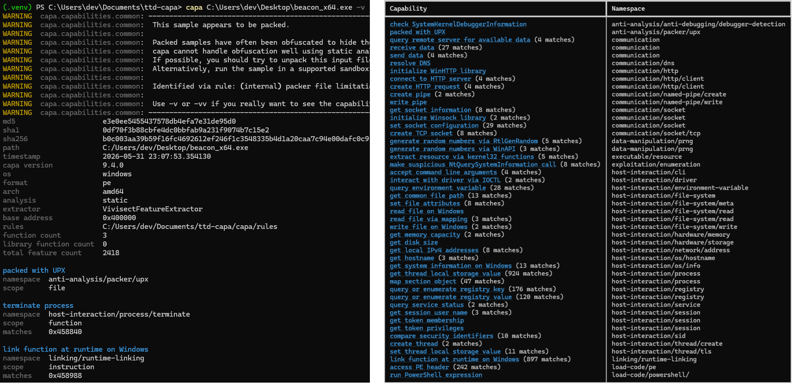
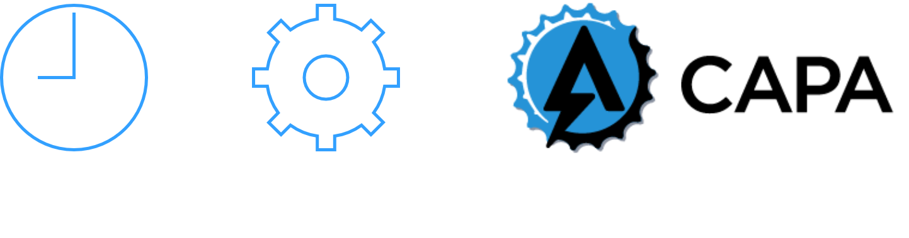

> [!Warning]
> This project was generated using Claude. I performed testing for my own use cases,
> but you may run into issues. If you do, feel free to open an issue on this repository!

# Overview

ttd-capa is a [capa](https://github.com/mandiant/capa) compatible capability extractor for Time
Travel Debugging (TTD) traces. A TTD trace records the complete execution of a process, so it
exposes behavior that a static scan of the file on disk can't see. This particular implementation 
of ttd-capa leverages a custom-built capa rewrite in C++ which has proven to be several times 
more performant than the official Python version.



A static capa scan of a packed sample (left) typically identifies the packer and little else,
because the real code is not present in the file. ttd-capa scans the recorded execution instead,
so capabilities that exist only after unpacking are recovered (right).

# How it works



1. Record a TTD trace of the sample
2. Run `ttdcapa-extract.exe` on the trace. It replays the trace and writes a capa-compatible JSON
   report
3. Match that report against the capa rules with `capa-cpp`, which surfaces the capabilities

The extractor is built on Microsoft's TTD C++ SDK and
[nlohmann/json](https://github.com/nlohmann/json). It starts from the trace's module load events,
which tell it the address of every exported function along with its name and owning module. It
then replays the trace from start to finish, and every call that lands on one of those addresses
is written down: the module, the function, its arguments, its return value, and the position in
the trace where it happened.

Instead of a brute force approach, function arguments are decoded from API metadata. Two binary indexes 
ship with the extractor. One is built from [win32json](https://github.com/marlersoft/win32json) (Microsoft's 
Win32 metadata) and one from [phnt](https://github.com/winsiderss/phnt) (native API headers). Between
them they supply each call's parameter count and types, so flags and enums print by name and
`[Out]` parameters are read back once the callee has filled them in. A call with no signature
falls back to a heuristic: the four argument registers on x64, or the first four stack words on
x86. Those calls are marked `signature: false`.

String arguments need one more step. A replay only sees the memory the calling thread has already
touched, so a string the caller prepared earlier reads back as nothing and leaves a bare pointer
in the report. Most are picked up when the call returns, by which point the callee has usually
read the string itself. Recovering the few still missing means seeking back to each call and
reading again, which costs more than the rest of the extraction put together, so it is off unless
`--recover-strings` asks for it.

Watching calls doesn't say anything about code the program executes at runtime, which is where a packer or
loader puts the interesting part. `--scan-code` adds a second pass for that. It replays the trace
watching for memory that gets allocated, mapped, or made executable and then run. It then rebuilds
each such region's contents as they stood when code in it ran - one `.bin` snapshot per
generation - so a multi-stage loader yields one per stage. capa-cpp then runs its ordinary static
analysis over those snapshots, seeded with the instruction addresses the trace proves were
executed, so the disassembly starts from real entry points rather than guesses. A third pass can then 
replay the trace another time with execute watchpoints on the matched addresses. This provides a 
reconstructed timeline of when detected code capabilities were executed.

Rule matching is left to capa-cpp, a C++ reimplementation of capa's dynamic and static analysis
paths, vendored as the `capa-cpp/` submodule.

# Prerequisites

- Windows
- Visual Studio with the v145 MSVC build tools and C++20
- WinDbg or TTD CLI installed, for the TTD replay DLLs (`TTDReplay.dll` and `TTDReplayCPU.dll`)
- Python 3.10+, for the wrapper scripts
- vcpkg, to build capa-cpp

# Building

Clone, then initialise the submodules:

```powershell
git clone <repo-url> ttd-capa
cd ttd-capa
git submodule update --init
```

They supply `win32json` and `phnt` (API metadata for argument decoding), `capa-cpp` (the matcher),
and `rules` (capa rule collection)

Use `--init` rather than `--init --recursive` or `git clone --recursive`. capa-cpp carries its own
submodule for the IDA SDK, which only its IDA plugin needs. Using `--recursive` pulls that too, and 
nothing in this project uses it.

## ttd-capa

1. Open `ttd/ttdcapa-extract.sln` in Visual Studio.
2. Ensure the required NuGet packages (`Microsoft.TimeTravelDebugging.Apis` and `nlohmann.json`)
   are installed.
3. Set the configuration to `Release` and the platform to `x64`.
4. Build the solution.

This produces two outputs in `ttd/bin/x64/Release/`:

- `ttdcapa-extract.exe`, the command-line tool the wrapper scripts drive
- `ttdcapa.dll` (plus `ttdcapa.lib`), the same analysis passes behind a C ABI, for embedding in
  another program

To build just one from the command line, in a Developer PowerShell for VS (`MSBuild` and `vcpkg`
are not on the default PATH):

```powershell
MSBuild ttd\ttdcapa-extract.vcxproj -p:Configuration=Release -p:Platform=x64   # the tool
MSBuild ttd\ttdcapa.vcxproj         -p:Configuration=Release -p:Platform=x64   # the DLL
```

The build copies `ttd/data/win32-index.bin` and `ttd/data/phnt-index.bin` next to the output, and
warns if either is missing. Regenerate them with `python tools\build-win32-index.py` and
`python tools\build-phnt-index.py`. Without them the extractor still runs, but falls back to
heuristic argument capture.

The extractor also needs Microsoft's `TTDReplay.dll` and `TTDReplayCPU.dll` in the same directory
as `ttdcapa-extract.exe`. The build copies them automatically from `TTDRuntimeDir`, which defaults
to the TTD NuGet package's `build\native\bin\x64`. If that folder does not carry them, point the
build at a copy:

```powershell
MSBuild ttd\ttdcapa-extract.vcxproj -p:Configuration=Release -p:Platform=x64 -p:TTDRuntimeDir=<dir>
```

Copying both DLLs next to `ttdcapa-extract.exe` by hand works too. A WinDbg installation is 
one place to get them:

```powershell
Join-Path (Get-AppxPackage Microsoft.WinDbg).InstallLocation 'amd64\ttd'
```

## capa-cpp

Build the matcher once, with Visual Studio 2022/2026 (MSVC v143/v145, C++20) and vcpkg. The
`vcpkg.json` manifest lives in the submodule's inner `capa-cpp\` project directory, which is what
`--x-manifest-root` has to point at:

```powershell
cd capa-cpp
vcpkg install --triplet x64-windows-static --x-manifest-root=capa-cpp
MSBuild capa-cpp\capa-cpp.vcxproj -p:Configuration=Release -p:Platform=x64
# (or ./build.sh Release from Git Bash)
```

This produces a self-contained `capa-cpp.exe`, which the wrapper scripts locate automatically. The
scripts search every layout the submodule has used and take the most recently written executable,
so a stale binary from an older build does not win over a fresh one. A copy placed next to the
scripts wins outright, and `--capa-cpp <path>` pins one explicitly. See `capa-cpp/README.md` for
more.

# Usage

## Wrapper script

`ttd-capa.py` runs the extractor and the matcher in one step.

```powershell
python ttd-capa.py <trace.run> <rules-dir> [--sample sample.exe] [-- <capa-cpp args>]
```

By default the TTD report goes to a temp file that is deleted after the match. To keep it for 
other tool options (i.e. the timeline script) use `--json-output <path>` to write it somewhere you 
choose, or `--keep-json` to leave the temp file in place. Either way the path is printed to stderr.

```powershell
python ttd-capa.py <trace.run> <rules-dir> --json-output report.ttd.json
```

Anything after a bare `--` is forwarded to capa-cpp, for example `-vv` for the full match tree or
`-j` for a JSON ResultDocument:

```powershell
python ttd-capa.py <trace.run> <rules-dir> --sample sample.exe -- -vv
```

Common flags:

- `--sample <path>` - the on-disk sample, for accurate hashes in the report
- `--extractor <path>` / `--capa-cpp <path>` - override automatic searching for the capa-cpp binary
- `--json-output <path>` - write the TTD report to a known path and keep it
- `--keep-json` - keep the report in a temp file (path printed to stderr)
- `--max-calls N` - cap recorded calls (for very large traces)
- `--max-buffer N` - bytes kept from any one captured buffer (default 256)
- `--no-metadata` - disable metadata-driven decoding and use the heuristic capture everywhere
- `--recover-strings` - spend most of the run time (2.2s to 6.7s on a 75 MB trace) to decode a
  further ~1% of string arguments. Worth it when a rule hinges on a string the default run leaves
  as a pointer; see [docs/ARGUMENT-DECODING.md](docs/ARGUMENT-DECODING.md)
- `--with-stack-args` - for calls with no metadata only, read four more stack slots than the
  heuristic normally would
- `--win32-index <path>` - use a specific `win32-index.bin`
- `--rebuild-index` - delete an unloadable `.idx` and build a fresh one. Pass this if a run is
  unexpectedly slow: the TTD SDK will not replace a stale index unless asked, and without one the
  trace replays unindexed

## Manual

```powershell
# 1) generate the report from the trace
<ttdcapa-extract.exe> <trace.run> --sample <optional sample> -o report.ttd.json

# 2) match the report against capa rules
<capa-cpp.exe> report.ttd.json -r <rules-dir>
```

## Scanning runtime code

The dynamic pass matches API calls, so it is blind to code a packer or loader unpacks or injects at
runtime. `--scan-code` adds the reconstruction pass described above.

```powershell
# dynamic run, then reconstruct and static-scan the executable regions
python ttd-capa.py <trace.run> <rules-dir> --scan-code

# only the code scan, keeping the dumps for triage
python ttd-capa.py <trace.run> <rules-dir> --code-only --keep-dumps
```

Flags:

- `--code-only` - skip the dynamic call report
- `--max-code-scans N` - cap snapshots reconstructed per region (default 8; 0 = unlimited)
- `--scan-data` - also reconstruct and scan non-executable regions
- `--no-scan-modules` - do not watch the sample's own module images
- `--keep-dumps` - keep the reconstructed `.bin` snapshots
- `--code-output <path>` - write the static capability records as JSON, for `ttd-timeline.py --code`
- `--code-hits-output <path>` - also record where each matched code site executed
- `--max-region-bytes N` / `--max-write-log-bytes N` - memory budgets (defaults 256 MiB per region,
  1 GiB across all regions). Anything over budget is skipped with a diagnostic

The two views are complementary. The dynamic pass owns API-name features, which a reconstructed
region cannot supply because it has no import table. The static pass adds code-structure
capabilities the call sweep cannot see, such as crypto constants, stack strings, and embedded PEs.
See [docs/CODE-SCAN.md](docs/CODE-SCAN.md) for how the pass works and how to run it manually.

## Unified report

`--summary` runs both passes and prints one source-tagged report, with ATT&CK and MBC roll-ups and
a static-code detail listing (region, offset, and first TTD position) for triage:

```powershell
python ttd-capa.py <trace.run> <rules-dir> --summary
```

Each capability is tagged `dyn` (matched on API calls), `code` (matched in reconstructed code), or
`both`, with per-source match counts:

```
  68 unique capabilities: 50 from API calls, 39 from reconstructed code (3 region(s)), 21 seen by both.
...
Capability                                Namespace                                        Src   Dyn  Code
-----------------------------------------------------------------------------------------------------------
reference analysis tools strings          anti-analysis                                    code    -     9
check SystemKernelDebuggerInformation     anti-analysis/anti-debugging/debugger-detection  dyn     1     -
packed with UPX                           anti-analysis/packer/upx                         both    1     8
```

`ttd-report.py` builds the same report from artifacts you already have, without re-running the
trace:

```powershell
python ttd-report.py <report.ttd.json> -r <rules-dir> --code code-caps.json
```

## Timeline

Because the report carries TTD positions, `ttd-timeline.py` can show capabilities in the order
they were used, along with the call that triggered each one. Four rows below, out of the 2,684 a
75 MB beacon trace produces, with the skipped stretches marked and the two name columns narrowed
to fit this page -- the tool sizes those to the widest row in the whole table:

```
TTD POS    TID  CAPABILITY                            NAMESPACE                  TRIGGERING CALL
--------------------------------------------------------------------------------------------------
1EA:6F8      2  link function at runtime on Windows   linking/runtime-linking    kernel32.GetProcAddress(hModule=0x7ffa6a130000, lpProcName='CloseHandle') -> 0x7ffa6a186e40
1EA:774      2  link function at runtime on Windows   linking/runtime-linking    ntdll.LdrGetProcedureAddressForCaller(DllHandle=0x7ffa6a130000, ProcedureName='CloseHandle', ProcedureNumber=0x0, ProcedureAddress=0x65ff18->0x7ffa6a186e40@ret, Flags=0x0, CallerAddress=0x45898e) -> 0x0
   ...
27BB:380     4  connect to HTTP server                communication/http/client  wininet.InternetConnectA(hInternet=0xcc0004, lpszServerName='192.168.81.129', nServerPort=0x50, lpszUserName=0x0, lpszPassword=0x0, dwService=0x3, dwFlags=0x0, dwContext=0x11584c4) -> 0xcc0008
   ...
27C5:5E      4  initialize WinHTTP library            communication/http         winhttp.WinHttpOpen(pszAgentW='WinHTTP global session', dwAccessType=WINHTTP_ACCESS_TYPE_NO_PROXY, pszProxyW=0x0, pszProxyBypassW=0x0, dwFlags=0x0) -> 0xd13de0
```

Parameters are named, `->` shows a pointer's pointee, `@ret` marks an `[Out]` value read after the
callee filled it in, and enums render by name. `lpszServerName` above is the beacon's C2 address,
which is one of the strings the recovery described earlier brings back.

The timeline takes either a TTD report or a `.run` trace:

```powershell
# capabilities, from an existing report
python ttd-timeline.py report.ttd.json -r <rules-dir>

# straight from a trace, including reconstructed code capabilities
python ttd-timeline.py <trace.run> -r <rules-dir> --scan-code

# every recorded API call instead of capabilities (no rules needed)
python ttd-timeline.py report.ttd.json --calls
```

Produce the report with `ttd-capa.py --json-output report.ttd.json`, or run the extractor
directly with `-o`.

Reconstructed-code capabilities fold into the same timeline, with the triggering column pointing
at the region (`code@0x<address>`) instead of a call. The simplest way is to let `--scan-code` do
everything from the trace:

```powershell
python ttd-timeline.py <trace.run> -r <rules-dir> --scan-code
```

That runs all of it in one go -- extract, match, reconstruct the regions, static-scan them, and
replay once more to find where each match executed -- so code rows arrive already placed at the
moment they ran, interleaved with the API calls. Nothing needs to be passed in.

The `--code` and `--code-hits` options are for the other direction: artifacts you already have, so
a long trace need not be replayed again. `ttd-capa.py` writes them with `--code-output` and
`--code-hits-output`:

```powershell
# produce the three artifacts once
python ttd-capa.py <trace.run> <rules-dir> --scan-code --json-output report.ttd.json --code-output code-caps.json --code-hits-output hits.json

# then build timelines from them without touching the trace
python ttd-timeline.py report.ttd.json -r <rules-dir> --code code-caps.json --code-hits hits.json

# code capabilities on their own, no dynamic report
python ttd-timeline.py --code code-caps.json --code-hits hits.json
```

`--code-hits` is optional. Without it a code capability sits at the position where its region was
reconstructed rather than where it ran, which the footer of the listing calls out as
`region-positioned`. See [docs/CODE-SCAN.md](docs/CODE-SCAN.md) for what the passes do.

# Embedding

The same analysis passes are available in-process through `ttdcapa.dll` and its C header,
`ttd/include/ttdcapa.h`:

```c
ttdcapa_extract_options options;
memset(&options, 0, sizeof(options));
options.struct_size       = sizeof(options);
options.common.trace_path = L"beacon.run";
options.common.log        = my_log_callback;   /* progress lines, or NULL for stderr */

ttdcapa_string report = { 0 };
if (ttdcapa_extract_report(&options, &report) == TTDCAPA_OK) {
    /* report.data is the TTD report JSON; hand it to capa-cpp */
    ttdcapa_string_free(&report);
}
```

Progress reporting is redirectable and every pass takes a cancellation callback, so a long replay
can be stopped from the UI thread. Rule matching stays capa-cpp's job either way: ttd-capa produces
the evidence. `ttd/examples/embed-demo.c` is a complete working consumer, and
[docs/EMBEDDING.md](docs/EMBEDDING.md) covers the ABI rules, the call sequence, and the output
formats.

# Supported and not supported

Supported:

- x64 and x86 traces, including WoW64. Bitness is decided per call from the PE headers of the
  module owning the call target, not once per trace, because a WoW64 process runs both widths at
  once
- exact argument decoding for the public Win32 SDK surface and the native API covered by phnt
- `[Out]` parameters, counted `UNICODE_STRING` and `ANSI_STRING` descriptors, and enum and flag
  names
- static analysis of memory regions created during the recording, via `--scan-code`

Not supported:

- ARM and ARM64 traces
- functions that are not directly exported by a loaded module
- COM interface methods
- exact arguments for APIs with no metadata (`ntdll` internals, undocumented APIs, CRT helpers).
  These fall back to the heuristic capture described above and are marked `signature: false`
- variadic functions beyond their fixed parameters, since the argument count is not statically
  knowable
- structure fields. Structure parameters are recorded as pointers and are not expanded
- some x86 signatures, where a pointer-sized typedef such as `WPARAM` leaves the argument layout
  ambiguous. Those calls fall back to the heuristic capture
- API-name features in the `--scan-code` static pass. A reconstructed region has no import table,
  so dynamically resolved API names stay the dynamic pass's job
- regions not created during the recording. Normally loaded DLLs are out of scope for `--scan-code`
